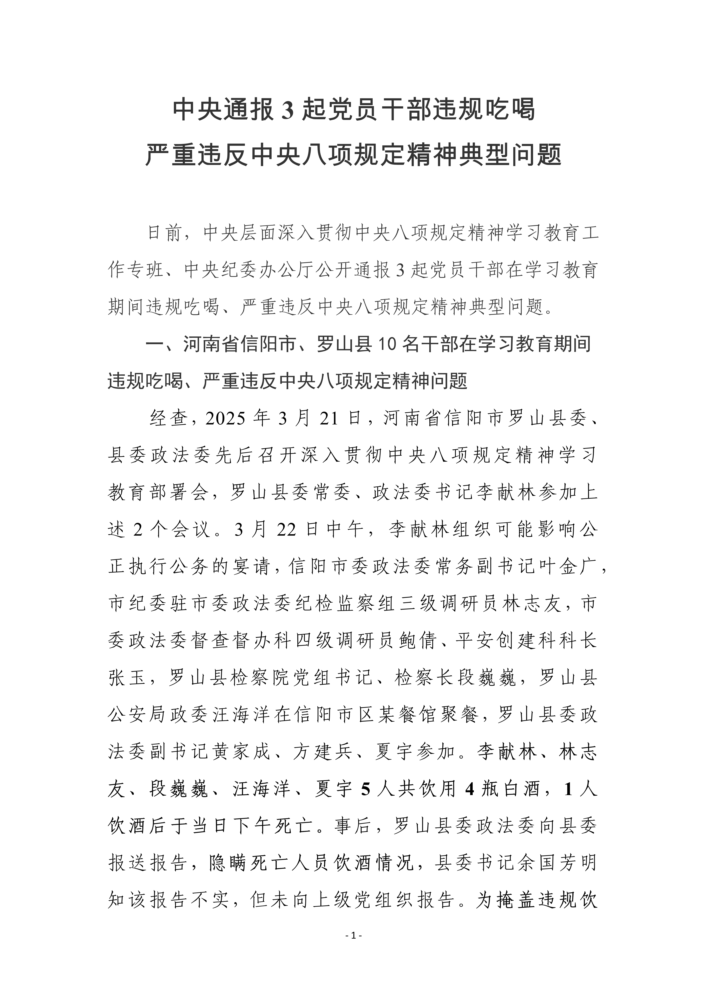
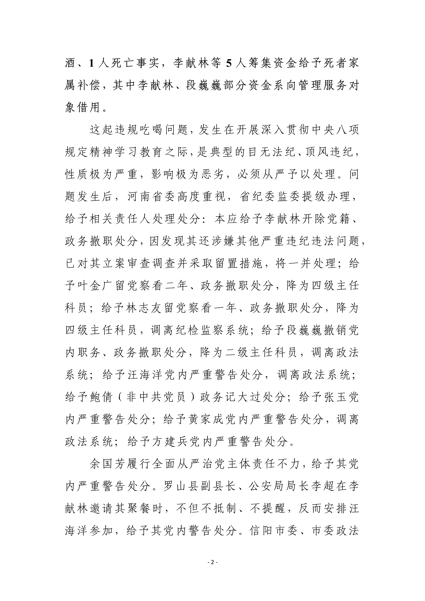
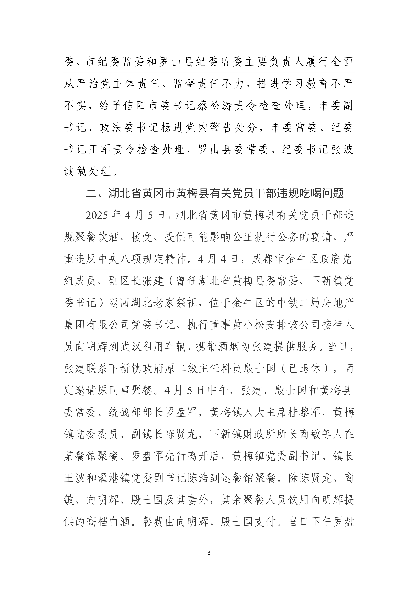
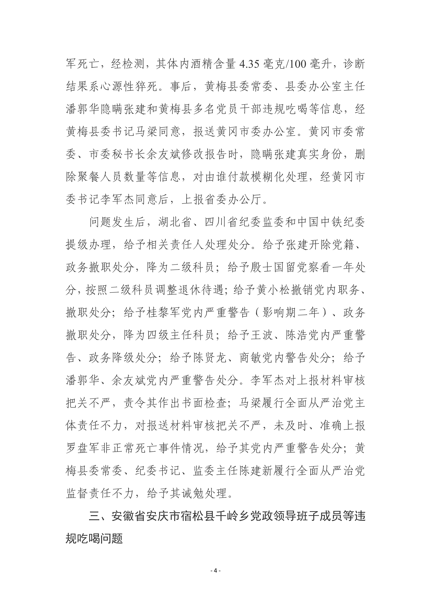
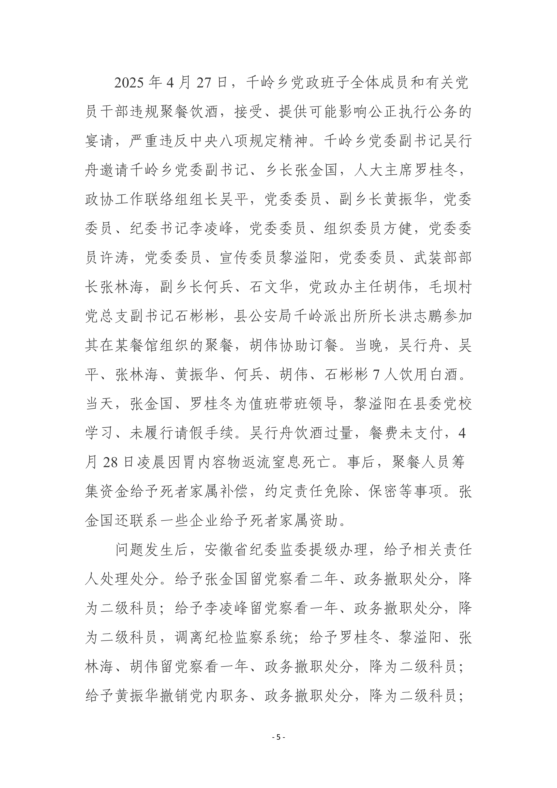
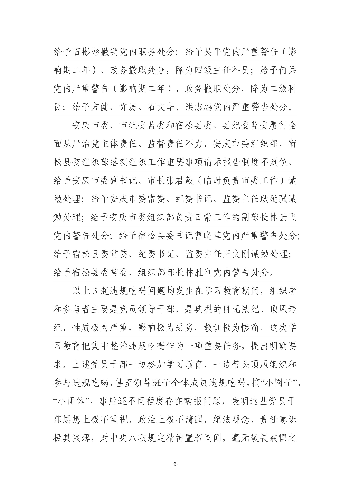
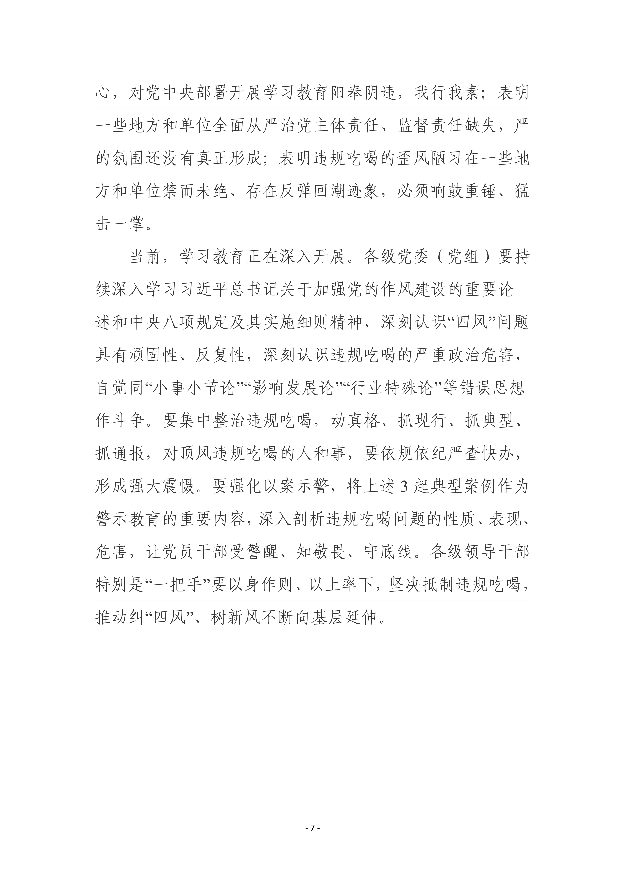

# 第一党小组会 2025年6月23日

---

   # <pan style="background-color: #ffffcc; font-weight:bold;">《习近平关于加强党的作风建设论述摘编》之六、七》

---
#### 第六、各级领导干部要带头转变作风，身体力行，以上率下
* __党风廉政建设，关键在领导干部，特别是中央要带头。“上梁不正下梁歪，中梁不正倒下来。”要求别人做到的，自己首先要做到；要求别人不做的，自己首先不做。我们要以身作则，带头反对腐败，带头遵守廉洁自律各项规定，带头遵守中央关于工作和生活待遇等方面的规定，切实管好自己，管好配偶、子女和身边工作人员，决不要谋私利，决不要搞任何形式的特权，自觉接受各级党组织和广大党员干部群众的监督，给全党带个好头。__
 *在十八届中央政治局常委会、中央政治局第一次会议上的讲话（2012年11月15日、16日）*
* __各级领导班子要牢记党和人民嘱托，发扬“功成不必在我、功成必定有我”的精神，坚持一张蓝图绘到底，对已有的部署和规划，只要是科学的、切合新的实践要求的、符合人民群众愿望的，就要坚持，一茬接着一茬干，防止换届后容易出现的政绩冲动、盲目蛮干、大干快上以及“换赛道”、“留痕迹”等现象。__
《在学习贯彻习近平新时代中国特色社会主义思想主题教育工作会议上的讲话》（2023年4月3日）*
* __要树牢造福人民的政绩观，带头走好新时代党的群众路线，纠治形式主义、官僚主义顽瘴痼疾，切实为基层减负，以作风转变促工作落实。要保持自我革命精神，在洁身自好、廉洁自律上树标杆、作表率，履行全面从严治党主体责任。要立足自身职责，强化政治担当，突出重点、把握关键，锐意进取、真抓实干，以中国式现代化进一步凝心聚力，为推进强国建设、民族复兴伟业而团结奋斗。在审阅有关同志述职报告时作出的指示__
（2024年2月），《人民日报》2024年2月27日*
* __领导干部特别是高级干部担负着推进改革的重要职责。要增强政治责任感、历史使命感，以攻坚克难、迎难而上的政治勇气，直面矛盾问题不回避，铲除顽瘴痼疾不含糊，应对风险挑战不退缩，奋力打开改革发展新天地。《进一步全面深化改革中的几个重大理论和实践问题》__
*（2024年10月29日），《求是》杂志2025年第2期*

---

#### 第七、坚持正风肃纪反腐相贯通
* __党的纪律为正确行使权力、防止以权谋私划出了底线、设置了禁区，是党员、干部保持清正廉洁的安全防护栏。敬畏纪律、遵守纪律，就能抵御腐蚀、百毒难侵。只要滋生腐败的土壤和条件仍然存在，反腐败斗争就永远在路上。对反腐败斗争形势要异常清醒、态度要异常坚决，决不能松懈，决不能手软。中央政治局的同志肩负重任，必须更加严格要求自己，对手中的权力要慎之又慎。要抓好分管领域或主政地方的党风廉政建设，坚决同各种不正之风和腐败现象作斗争，加强对家人和身边工作人员的教育管理。__
*在中央政治局民主生活会上的讲话（2024年12月26日、27日）*
* __深入推进风腐同查同治。不正之风和腐败问题相互交织，是现阶段党风廉政建设和反腐败斗争要着力解决的突出问题。要始终坚持零容忍，把中央八项规定作为铁规矩、硬杠杠，念好“紧箍咒”，严肃查处顶风违纪、隐形变异的“四风”问题，督促党员、干部“勿以恶小而为之”，坚决反对特权思想和特权现象，树牢正确权力观、政绩观、事业观。__
*《在第二十届中央纪律检查委员会第四次全体会议上的讲话》（2025年1月6日）*
* __要增强以案促改促治实效，推动完善权力配置运行的制约和监督机制，丰富防治新型腐败和隐性腐败有效办法。要坚持正风肃纪反腐相贯通，以“同查”严惩风腐交织问题，以“同治”铲除风腐共性根源。__
*《在第二十届中央纪律检查委员会第四次全体会议上的讲话》（2025年1月6日）*
* __要巩固拓展党纪学习教育成果，坚持党性党风党纪一起抓、正风肃纪反腐相贯通，完善权力配置运行的制约和监督机制，持续整治形式主义为基层减负，持续整治群众身边不正之风和腐败问题，推动干部在遵规守纪、清正廉洁的前提下大胆干事。__
*在吉林长春听取吉林省委和省政府工作汇报时的讲话（2025年2月8日）*

---

# <pan style="background-color: #ffffcc; font-weight:bold;">《深入贯彻中央八项规定精神的成效和经验》
---

**一、习近平总书记关于深入贯彻中央八项规定精神的重要论述生动彰显我们党的强大真理力量和强大人格力量**
 ###### （一）鲜明提出制定实施中央八项规定是党在新时代的徙木立信之举。
 ###### （二）鲜明提出落实中央八项规定要从中央政治局抓起、自上而下推动。
 ###### （三）鲜明提出中央八项规定是改进作风的切入口和动员令。
###### （四）鲜明提出制定和落实中央八项规定要坚持从严要求。
###### （五）鲜明提出制定和落实中央八项规定要聚焦突出问题、回应群众期盼。
###### （六）鲜明提出中央八项规定是长期有效的铁规矩、硬杠杠。
---
**二、党中央带头、全党行动，有力有序深入贯彻中央八项规定精神**
 ###### （一）习近平总书记带头，中央政治局严格执行中央八项规定。
 ###### （二）加强理论武装，筑牢贯彻中央八项规定精神的思想根基。
 ###### （三）聚焦“四风”突出问题，步步深入靶向施治。
 ###### （四）强化监督执纪，保持高压态势。
 ###### （五）深化标本兼治，风腐同查同治。

---

**三、一子落地、满盘皆活，以作风建设新成效赢得人民群众信任拥护**
 ###### （一）“两个确立”深得民心，“两个维护”深入人心。
 ###### （二）党内政治生活更加严格，党内政治生态不断净化。
 ###### （三）享乐主义、奢靡之风得到有力遏制，形式主义、官僚主义得到重点整治。
 ###### （四）党同人民群众的血肉联系更加密切，党长期执政的基础更加巩固。
 ###### （五）党员、干部工作状态和精神状态更加积极，建功新时代的精气神得到提振。
 ###### （六）以优良党风带动社风民风向上向善，化风成俗迈出坚实步伐。

---
**四、在实践中总结、从总结中提升，积累的经验弥足珍贵**
 ###### （一）必须坚持以上率下、示范带动。
 ###### （二）必须坚持固本培元、激浊扬清。
 ###### （三）必须坚持心系群众、情系百姓。
 ###### （四）必须坚持制度治党、依规治党。
 ###### （五）必须坚持动真碰硬、久久为功。
 ###### （六）必须坚持明确责任、压实责任。

---

 # <pan style="background-color: #ffffcc; font-weight:bold;">《违反中央八项规定精神典型案例》
 

---

---

---

---

---

---

---

---

 #  <pan style="background-color: #ffffcc; font-weight:bold;">《围绕“充分认清贯彻落实中央八项规定精神重大意义切实汲取典型案例教训，以优良作风推动公司生产经营发展》

 
 ---